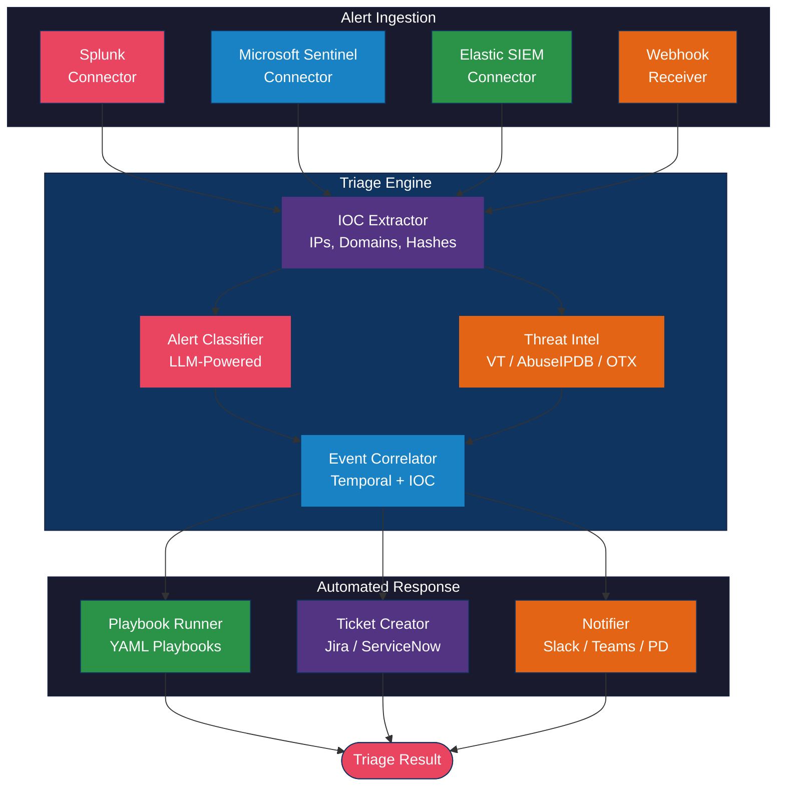
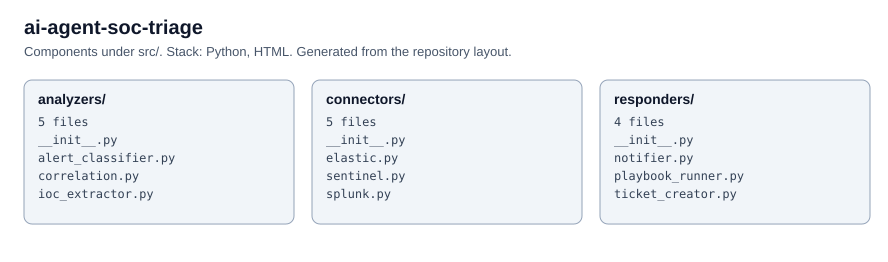

# AI Agent SOC Triage

A Python-based Security Operations Center (SOC) triage agent that uses LLMs to analyze security alerts, extract indicators of compromise, correlate events, look up threat intelligence, and execute automated response playbooks. Cloud-agnostic with support for Splunk, Microsoft Sentinel, and Elastic SIEM.

## Architecture



## Prerequisites

| Requirement | Version | Notes |
|---|---|---|
| Python | >= 3.11 | Required for modern type hint syntax |
| pip | >= 23.0 | For dependency installation |
| OpenAI API key | - | For LLM-based alert classification |
| SIEM access | - | Splunk, Sentinel, or Elastic credentials |
| Threat intel keys | - | Optional: VirusTotal, AbuseIPDB, OTX |

## Installation

```bash
# Clone the repository
git clone https://github.com/your-org/ai-agent-soc-triage.git
cd ai-agent-soc-triage

# Create and activate a virtual environment
python -m venv .venv
source .venv/bin/activate  # On Windows: .venv\Scripts\activate

# Install dependencies
pip install -e ".[webhook,dev]"

# Configure environment variables
cp .env.example .env
# Edit .env with your API keys and SIEM credentials
```

## Configuration

### Environment Variables

| Variable | Required | Default | Description |
|---|---|---|---|
| `OPENAI_API_KEY` | Yes | - | OpenAI API key for alert classification |
| `SIEM_PROVIDER` | No | `splunk` | SIEM platform: `splunk`, `sentinel`, `elastic` |
| `SPLUNK_HOST` | No | `localhost` | Splunk instance hostname |
| `SPLUNK_USERNAME` | No | - | Splunk username |
| `SPLUNK_PASSWORD` | No | - | Splunk password |
| `VIRUSTOTAL_API_KEY` | No | - | VirusTotal API key for IOC lookups |
| `ABUSEIPDB_API_KEY` | No | - | AbuseIPDB API key for IP reputation |
| `OTX_API_KEY` | No | - | AlienVault OTX API key |
| `TICKET_BASE_URL` | No | - | Jira/ServiceNow base URL |
| `TICKET_API_KEY` | No | - | Ticketing system API key |
| `TICKET_USERNAME` | No | - | Ticketing system username |
| `SLACK_WEBHOOK_URL` | No | - | Slack incoming webhook for notifications |
| `TEAMS_WEBHOOK_URL` | No | - | Teams incoming webhook |
| `PAGERDUTY_API_KEY` | No | - | PagerDuty Events API routing key |

### TriageConfig Options

| Parameter | Type | Default | Description |
|---|---|---|---|
| `llm` | `LLMConfig` | OpenAI GPT-4o | LLM provider for classification |
| `siem` | `SIEMConfig` | Splunk | SIEM connection settings |
| `threat_intel` | `ThreatIntelConfig` | - | Threat intel API keys |
| `ticket` | `TicketConfig` | Jira | Ticketing system settings |
| `notification` | `NotificationConfig` | Slack | Notification channel config |
| `playbook_directory` | `str` | `./playbooks` | Path to YAML playbook files |
| `auto_respond_threshold` | `str` | `high` | Minimum severity for auto-response |
| `enable_auto_response` | `bool` | `False` | Enable automatic playbook execution |
| `max_correlation_window_minutes` | `int` | `60` | Time window for alert correlation |

## Usage Example

```python
from datetime import datetime, timezone
from src.analyzers.correlation import SecurityAlert
from src.config import TriageConfig
from src.triage_engine import TriageEngine

# Initialize the triage engine
config = TriageConfig.from_env()
engine = TriageEngine(config)

# Create an alert (or ingest from SIEM)
alert = SecurityAlert(
    alert_id="ALERT-001",
    source="splunk",
    title="Multiple Failed Login Attempts from External IP",
    description="47 failed SSH login attempts from 203.0.113.42 in 5 minutes",
    timestamp=datetime.now(timezone.utc),
    severity="high",
    raw_data={"src_ip": "203.0.113.42", "dest_port": 22},
)

# Run the triage pipeline
result = engine.triage(alert)

print(f"Severity: {result.classification.severity.value}")
print(f"Category: {result.classification.category.value}")
print(f"Actionable: {result.is_actionable}")
for action in result.classification.recommended_actions:
    print(f"  - {action}")
```

### Running Examples

```bash
# Single alert analysis
python -m examples.analyze_alert

# Batch triage of multiple alerts
python -m examples.batch_triage
```

## Step-by-Step Implementation Guide

1. **Install dependencies** -- Follow the installation section to set up the Python environment and install all packages.

2. **Configure SIEM connectivity** -- Set the SIEM environment variables for your platform (Splunk, Sentinel, or Elastic). Ensure network access to the SIEM API endpoints.

3. **Set up LLM access** -- Configure the `OPENAI_API_KEY` (or alternative LLM provider). The alert classifier uses the LLM to determine severity, category, and recommended actions.

4. **Configure threat intelligence feeds (optional)** -- Add API keys for VirusTotal, AbuseIPDB, and/or AlienVault OTX. These enrich IOCs extracted from alerts with reputation data.

5. **Customize playbooks** -- Edit YAML files in the `playbooks/` directory to match your organization's response procedures. Register action handlers in the `PlaybookRunner` for each action type your playbooks reference.

6. **Set up notifications** -- Configure Slack/Teams webhooks or PagerDuty routing keys. Notifications are sent automatically for high and critical severity alerts.

7. **Connect ticketing** -- Configure Jira or ServiceNow credentials. Tickets are created automatically for actionable alerts with full context, IOCs, and MITRE ATT&CK mappings.

8. **Deploy** -- Run the triage engine as a service. Use the webhook receiver for real-time alert ingestion, or poll your SIEM connector on a schedule. Enable `auto_respond` once playbook handlers are fully tested.

## Playbook Format

Playbooks are defined in YAML with conditional steps:

```yaml
name: Brute Force Response
category: brute_force
severity_threshold: medium
steps:
  - name: Block Source IP
    action: block_ip
    parameters:
      duration_hours: 24
    condition: "confidence > 0.7"
    on_failure: continue
```

## Documentation Links

- [LangChain Extraction](https://python.langchain.com/docs/use_cases/extraction/) -- Structured data extraction patterns used for alert classification.
- [Splunk REST API](https://docs.splunk.com/Documentation/Splunk/latest/RESTREF/RESTsearch) -- Splunk search job API reference for the Splunk connector.
- [Microsoft Sentinel Data Sources](https://learn.microsoft.com/en-us/azure/sentinel/connect-data-sources) -- Sentinel incident and alert APIs.
- [Elasticsearch REST APIs](https://www.elastic.co/guide/en/elasticsearch/reference/current/rest-apis.html) -- Elastic search and detection signal APIs.

## Project Structure

```
ai-agent-soc-triage/
├── src/
│   ├── triage_engine.py       # Main triage pipeline orchestrator
│   ├── config.py              # Configuration management
│   ├── analyzers/
│   │   ├── alert_classifier.py    # LLM-powered severity/category classification
│   │   ├── ioc_extractor.py       # Regex-based IOC extraction
│   │   ├── threat_intel.py        # VirusTotal/AbuseIPDB/OTX lookups
│   │   └── correlation.py         # Temporal and IOC-based event correlation
│   ├── connectors/
│   │   ├── splunk.py          # Splunk REST API connector
│   │   ├── sentinel.py        # Microsoft Sentinel connector
│   │   ├── elastic.py         # Elastic Security connector
│   │   └── webhook.py         # Generic webhook receiver
│   └── responders/
│       ├── playbook_runner.py # YAML playbook execution engine
│       ├── ticket_creator.py  # Jira/ServiceNow ticket creation
│       └── notifier.py        # Slack/Teams/PagerDuty/Email notifications
├── playbooks/
│   ├── phishing.yaml          # Phishing response playbook
│   ├── malware.yaml           # Malware containment playbook
│   └── brute_force.yaml       # Brute force response playbook
├── examples/
│   ├── analyze_alert.py       # Single alert triage example
│   └── batch_triage.py        # Batch processing example
├── requirements.txt
├── pyproject.toml
├── LICENSE
└── CHANGELOG.md
```

## License

This project is licensed under the MIT License. See [LICENSE](LICENSE) for details.

<!-- architecture -->
## Architecture


